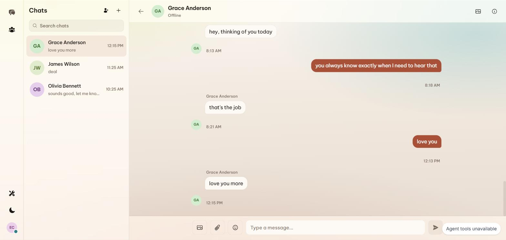
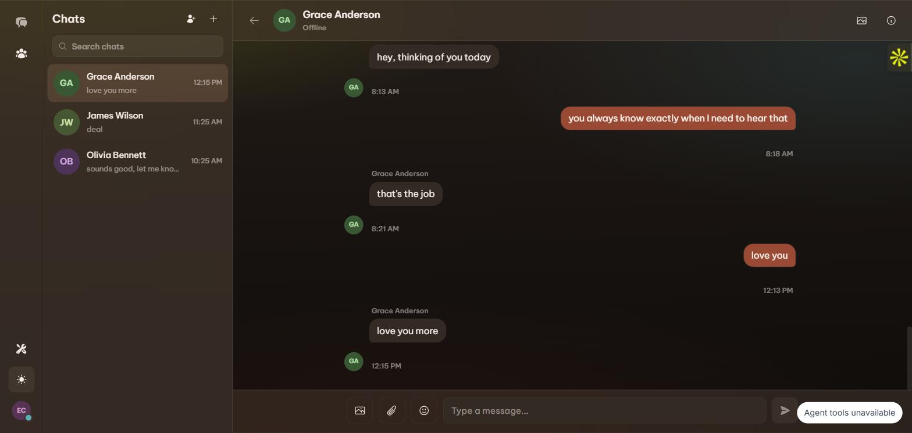

<div align="center">
  

# Verb

### Nouns need eyes. Verbs need a voice.

**An accessible, real-time messenger whose meaningful actions are exposed as WebMCP tools.**

A blind or low-vision user can ask an AI agent to find, read, summarize, draft,
send, react, and navigate without making the agent guess where to click.

[Open the live app](https://verb-webmcp.vercel.app) ·
[View the public repository](https://github.com/hungtruongOwolf/webmcp-challenge) ·
**Demo video: coming soon**

`WebMCP` · `Next.js 15` · `React 19` · `TypeScript` · `Supabase` · `MIT`
</div>

---

## Submission at a glance

| Requirement | Link or status |
|---|---|
| Working application | [verb-webmcp.vercel.app](https://verb-webmcp.vercel.app) |
| Demo video | **Coming soon** — public YouTube link will be added here |
| Public source code | [github.com/hungtruongOwolf/webmcp-challenge](https://github.com/hungtruongOwolf/webmcp-challenge) |
| Open-source license | [MIT License](LICENSE) |
| WebMCP implementation | [Registration lifecycle](app/webmcp/connection-provider.tsx) · [tool catalog](lib/webmcp/register.ts) |

## Judge quick start

1. Open the [live app](https://verb-webmcp.vercel.app) in
   ChatGPT's in-app browser, or in Google Chrome 149+ with
   `chrome://flags/#enable-webmcp-testing` enabled.
2. Sign in or create an account. If judging credentials are supplied with the
   Devpost submission, use those credentials.
3. Confirm that the page reports **WebMCP connected**.
4. Ask the agent to try a few natural-language tasks:

   > Check my Verb connection, list my conversations, and catch me up on
   > the most recent one.

   > Find messages about the launch, then draft a reply for me. Let me review
   > it before sending.

   > Describe the latest image in this conversation and react to the message
   > with a heart.

5. Open the in-app **WebMCP activity** panel to see tool registration and calls
   as they happen.

The project follows the browser setup recommended in the
[WebMCP Challenge resources](https://webmcp.devpost.com/resources).

## Why Verb is a strong fit for WebMCP

Close your eyes and try to operate a messaging app. Finding the unread thread,
locating the right control, reacting to a particular message, or understanding
an image can turn a simple conversation into a long navigation exercise.

Traditional browser agents do not fully solve that problem. They still inspect
screens, infer intent from labels and pixels, and attempt a sequence of clicks.
That approach is fragile, especially when the screen changes or user-generated
content contains misleading instructions.

WebMCP gives the page a semantic action layer. Verb does not ask the agent to
*find the send button*. It registers a typed `send_message` action. It does not
ask the agent to *scan the sidebar*. It provides `list_conversations`. The agent
works with the signed-in user's real session, and the application remains the
authority for validation, permissions, and side effects.

That is why this use case fits WebMCP so well: messaging is made of verbs.
Once those verbs are explicit, they no longer require sight, precise pointer
control, or knowledge of the current visual layout.

## A better human-agent experience

WebMCP lets the human express intent while the application supplies safe,
structured capabilities.

| The person asks… | The agent can… | The experience improves because… |
|---|---|---|
| “What did I miss?” | List, read, and summarize the relevant conversation | The user hears one useful recap instead of traversing a message history |
| “Did anyone mention the launch date?” | Search one conversation with an optional date range | The answer comes from structured results, not visual page scanning |
| “Reply that Friday works.” | Save a draft, let the user review it, then send it | Composition and execution are separate, preserving human control |
| “What is in the photo?” | Retrieve the authorized image and ask a vision model to describe it | Visual content becomes accessible inside the same conversation flow |
| “Start a group with Maya and Tony.” | Resolve people and create the group | A multi-screen workflow becomes one clear request |
| “Leave this group.” | Explain the impact and require a second confirmed call | A destructive action stays deliberate and auditable |

Before WebMCP, completing these flows by voice required a screen-driving agent
to repeatedly interpret the interface. With Verb, people choose the goal and
retain control; agents combine explicit tools to carry it out.

## What the app includes

- One-to-one and group conversations with real-time messages, typing state,
  seen state, and sidebar updates
- Private image and file attachments backed by signed URLs
- Message search, reactions, and 20 emoji stickers
- Message editing and unsend (soft delete), with live updates for every
  participant
- Per-conversation drafts that persist when the user navigates away
- AI summaries that combine read and unread history into one coherent recap
- AI image descriptions for blind and low-vision users
- Passkey and password authentication, including a passkey-only sign-up
  that never shows or asks for a password
- Keyboard and screen-reader-conscious authentication and navigation

## WebMCP implementation

Verb uses the browser's `document.modelContext` API directly. Two public tools
are available before authentication: `get_connection_status`, and `sign_up`,
which creates a passkey-only account (no password) -- the agent collects a
name and email, then the browser's own WebAuthn prompt is what the human
completes directly, never the agent. After sign-in, the connection provider
registers 21 session-scoped tools and removes them with an `AbortSignal` when
the session changes.

The real registration lifecycle lives in
[`app/webmcp/connection-provider.tsx`](app/webmcp/connection-provider.tsx).
In simplified form, each tool is registered like this:

```ts
const controller = new AbortController();

await document.modelContext.registerTool(
  {
    name: "get_connection_status",
    description: "Report whether the page is signed in and agent tools are connected.",
    inputSchema: {
      type: "object",
      properties: {},
      additionalProperties: false,
    },
    annotations: {
      readOnlyHint: true,
      untrustedContentHint: false,
    },
    execute: async () => ({
      content: [{ type: "text", text: JSON.stringify(connectionState) }],
    }),
  },
  { signal: controller.signal }
);
```

The authenticated catalog is assembled in
[`lib/webmcp/register.ts`](lib/webmcp/register.ts). Each tool has a focused
description, JSON input schema, behavioral annotations, and an `execute`
function that uses the current user's browser session.

```text
Human voice or text
        ↓
AI agent chooses a registered tool
        ↓
document.modelContext.registerTool(...)
        ↓
Verb validates input and uses the signed-in Supabase session
        ↓
Postgres row-level security authorizes the operation
        ↓
Small, structured result returns to the agent and activity panel
```

### Registered tools

There are **22 registered tools in an authenticated session**: one public
connection tool plus 21 messaging tools.

| Category | Tool | Purpose |
|---|---|---|
| Connection | `get_connection_status` | Report sign-in and WebMCP connection state |
| Account (public, signed-out only) | `sign_up` | Create a passkey-only account -- no password |
| Discover | `list_conversations` | List the user's conversations |
| Discover | `read_conversation` | Read recent messages with pagination |
| Discover | `search_messages` | Search a conversation with an optional date range |
| Discover | `search_people` | Find a person by name or email |
| Discover | `get_my_profile` | Return the signed-in user's profile |
| Navigate | `open_conversation` | Open an existing conversation by id, or an existing 1:1 by person (read-only) |
| Navigate | `start_conversation` | Start a new one-to-one conversation |
| Compose | `draft_message` | Save a draft without sending it; calling it again edits the draft |
| Compose | `send_message` | Send the currently saved draft |
| Compose | `edit_message` | Change the text of a message already sent |
| Compose | `delete_message` | Unsend a message after explicit confirmation |
| Compose | `react_to_message` | Add or remove one of six reactions |
| Compose | `send_sticker` | Send one of 20 emoji stickers |
| Organize | `create_group` | Create a group from names, emails, or IDs |
| Organize | `delete_conversation` | Leave or delete a conversation after explicit confirmation |
| Understand | `summarize_conversation` | Produce one read-and-unread narrative summary |
| Understand | `describe_image` | Describe an authorized image with a vision model |
| Understand | `read_file` | Read an authorized shared file |
| Understand | `read_link` | Fetch text from a link shared in a message |
| Account | `setup_passkey` | Guide the user through passkey enrollment |
| Account | `sign_out` | End the current session |

## Safety and trust boundaries

Verb treats the application and database as the authority, not the agent.

- **Session-scoped authority:** tools run in the browser with the signed-in
  user's Supabase session. No service key or password is handed to the agent.
- **Database enforcement:** Postgres row-level security controls which
  conversations, messages, profiles, and files the user can access.
- **Untrusted content stays data:** message bodies are labeled as untrusted
  before returning to the agent, reducing the chance that prompt-injection
  text is mistaken for an instruction.
- **Bounded output:** shared result clamping keeps tool responses within a
  1,500-character budget.
- **Deliberate writes:** sending uses a draft-then-send pattern. Leaving or
  deleting a conversation, and unsending a message, require a second call
  with `confirm: true` after the user agrees.
- **Lifecycle cleanup:** registration uses abort signals so tools from an old
  or signed-out session do not remain active.

## Screenshots

| Light mode | Dark mode |
|---|---|
|  |  |

## Architecture

| Layer | Implementation |
|---|---|
| Web application | Next.js 15 App Router, React 19, TypeScript, Tailwind CSS |
| WebMCP lifecycle | Connection provider, public status tool, authenticated catalog, abort-based cleanup |
| Data and authorization | Supabase Postgres with row-level security and focused RPCs |
| Realtime | Database-triggered broadcasts on conversation and per-user topics |
| File storage | Private `chat-images`, `chat-files`, and `avatars` buckets with signed URLs |
| Authentication | Passkeys through Supabase WebAuthn and passwords |
| AI features | Configurable Anthropic, Gemini, or OpenAI provider for image descriptions and summaries |

### Project map

```text
app/
  api/                         messages, conversations, files, AI routes
  components/                  accessible UI and WebMCP activity panel
  conversations/              inbox and conversation views
  libs/                        Supabase, authentication, uploads, AI clients
  webmcp/                      browser API, connection lifecycle, tool registry
lib/webmcp/
  tools/                       one file per authenticated WebMCP tool
  register.ts                  assembles the authenticated catalog
  budget.ts                    output clamping and untrusted-content wrapping
supabase/migrations/           schema, RLS policies, triggers, storage, RPCs
e2e/                           Playwright accessibility coverage
tests/                         shared Vitest setup
```

## Run locally

### Prerequisites

- Node.js 20+
- npm
- A Supabase project
- At least one Anthropic, Gemini, or OpenAI API key for AI features

### Setup

```bash
git clone https://github.com/hungtruongOwolf/webmcp-challenge.git
cd webmcp-challenge
npm install
cp .env.example .env.local
```

Fill in `.env.local`:

```dotenv
NEXT_PUBLIC_SUPABASE_URL=https://<project-ref>.supabase.co
NEXT_PUBLIC_SUPABASE_ANON_KEY=<your-anon-key>

NEXT_PUBLIC_APP_ORIGIN=http://localhost:3000
NEXT_PUBLIC_PASSKEY_RP_ID=localhost

# Add at least one provider key.
ANTHROPIC_API_KEY=
GEMINI_API_KEY=
OPENAI_API_KEY=
```

Apply the database migrations and start the application:

```bash
npx supabase link --project-ref <your-project-ref>
npx supabase db push
npm run dev
```

Open [http://localhost:3000](http://localhost:3000).

> [!IMPORTANT]
> `NEXT_PUBLIC_APP_ORIGIN` and `NEXT_PUBLIC_PASSKEY_RP_ID` must describe the
> same host. Production passkeys also require HTTPS. `npm run build` verifies
> this configuration and rejects a production origin that points to localhost.

## Test and build

```bash
npm test                       # Vitest unit and component tests
npm run test:e2e               # Playwright end-to-end tests
npm run verify:passkey-config  # WebAuthn origin/RP validation
npm run build                  # production build
```

The accessible-auth Playwright spec uses a disposable Supabase account through
`E2E_USER_EMAIL` and `E2E_USER_PASSWORD`. Keep both variables server-side;
never expose them with a `NEXT_PUBLIC_` prefix.

## License

Verb is open-source software available under the [MIT License](LICENSE).

---

<div align="center">
  Built for the <a href="https://webmcp.devpost.com/">WebMCP Challenge</a>.
  <br />
  <strong>Nouns need eyes. Verbs need a voice.</strong>
</div>
